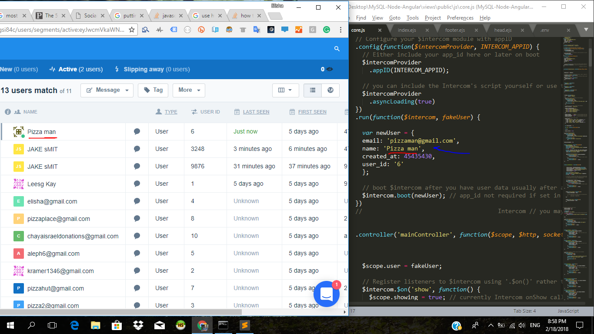

<h1>Segment Your Customers and Send them highly targeted emails - with Intercom</h1>

Intercom Integration Included: Define your currently-logged in User via the AngularJS run method.



"# MySQL-Node-Angular" 

The app allows you to send automated emails with MySQL and Node, and includes an Angular front-end with EJS and UI-Router for a single-page-application experience.


The app also uses <a href="https://www.npmjs.com/package/node-schedule">'node-schedule'</a> to automatically send the results of a MySQL database to your choice of email address[es].


<h2>How It Works</h2>

The app is kind of like an email server - which allows you to send customized emails to your choice of clients. It runs on MailGun. So, you have to first create a Mailgun account.

Once you've done that, within your .env file, we give you the option to add 2 databases. The first database is the database that will hold all the information regarding your email server - the schedules for specific mails to go out, saved segments of users, and saved content for emails.

The second database connection is for the db that you want to segment your audience from and to pull data from for custom reports.


<h2>Steps For Getting Started</h2>

Step 1: Create a database - any name.

Step 2: Import the 'database-edited.sql' file into your database - or just copy-paste that text into your SQL Command Query Runner. That will create the neccessary tables for the app to work.

Step 3: Add a .env file to your root directory that includes MySQL and Email Creds - should look like this:

```bash
export HOST=the.ip.goes.here	
export DATABASE=yourdbname
export USER=username
export PASSWORD=thepassword

export MAILGUN_USER=user@subdomain.domain.com
export MAILGUN_PASSWORD=longhashpassword

export HOST2=the.ip.goes.here	
export DATABASE2=yourseconddbname
export USER2=username
export PASSWORD2=thepassword

```


Currently the app will send an email every 42 seconds - you're gonna want to change that. Go to routes.js, and search for:

 var j = schedule.scheduleJob('42 * * * * *', function(){

Here's the syntax to control when emails get sent.


```bash
*    *    *    *    *    *
┬    ┬    ┬    ┬    ┬    ┬
│    │    │    │    │    |
│    │    │    │    │    └ day of week (0 - 7) (0 or 7 is Sun)
│    │    │    │    └───── month (1 - 12)
│    │    │    └────────── day of month (1 - 31)
│    │    └─────────────── hour (0 - 23)
│    └──────────────────── minute (0 - 59)
└───────────────────────── second (0 - 59, OPTIONAL)

```

<h2>Deploy To Heroku</h2>

You can upload the app to Heroku, and the automated emails will work - but you may have to pay to keep the app running full-time (i.e. pay for a 'dyno' - highly isolated Linux Process) so that your Heroku app is turned on when the scheduler reaches the Send-Time.