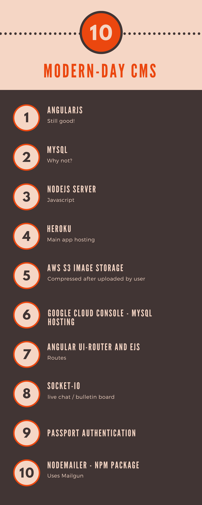
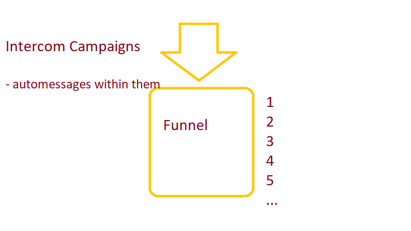
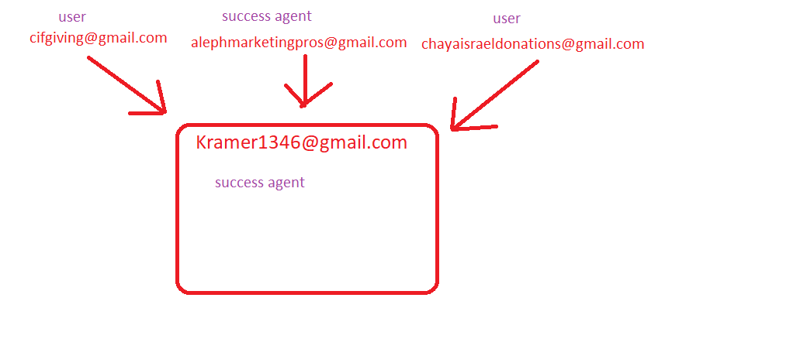

<h1>Live Startup Series</h1>

<a href="http://koalacms.herokuapp.com" target="_blank">Live Site Available Here</a>

Dear friends,

This repo has been the subject of many YouTube series tutorials, including:

- <a href="https://www.youtube.com/watch?v=xyA2qstl5YA" target="_blank">Building a Modern-Day CMS using NodeJS, AngularJS, MySQL</a>
- <a href="https://www.youtube.com/watch?v=xs-_kZUoRIY" target="_blank">Metabase Data Visualization</a>
- <a href="https://www.youtube.com/watch?v=8-31Ar8ea58" target="_blank">Using Intercom.io As Your CRM</a>
- <a href="https://www.youtube.com/watch?v=XAOvH6yFcz4&t=3s" target="_blank">Deploying to Heroku</a>


Table of Contents for this Repo:

- [Technologies Overview](#technologies)
- [Getting Started](#getting-started)
- [Deployment with Heroku](#deployment)
- [Intercom.io Integration](#intercom)
- [Automated Email Integration](#automated-email-integration)
- [License](#license)

<br>
<br>

Technologies
--------

The project includes a long list of technologies, including:



<br>
<br>

Getting Started
---------------

The easiest way to get started is to clone the repository:

```bash
# Get the latest snapshot
git clone https://github.com/ElishaKay/MySQL-Node-Angular

# Change directory
cd MySQL-Node-Angular

# Install NPM dependencies
npm install

# Or, if you prefer to use `yarn` instead of `npm`
yarn install

```

Next, we need to set up our MySQL Database.

Step 1: Using Xampp, or any other MySQL Client, create a database - with any name.

Step 2: Import the 'database.sql' file into your database - or just copy-paste that text into your SQL Command Query Runner. That will create the neccessary tables for the app to work.

Step 3: Add a .env file to your root directory that includes MySQL and Mailgun Email Creds - should look like this (the Mailgun and Second database Creds are optional - if you want to set up automated emails based on clients that match specific criteria:


```bash
HOST=the.ip.goes.here	
DATABASE=yourdbname
USER=username
PASSWORD=thepassword

MAILGUN_USER=user@subdomain.domain.com
MAILGUN_PASSWORD=longhashpassword

HOST2=the.ip.goes.here	
DATABASE2=yourseconddbname
USER2=username
PASSWORD2=thepassword

```

For Linux Machines, paste these lines into your CLI (replace the values of Database, User, and Password Accordingly):
```
export HOST=localhost
export DATABASE=koalacms
export USER=root
export PASSWORD=
```

Once, you've achieved that, Then simply start your app

```
node server.js 

or:

nodemon server.js
```


**Note:** I highly recommend installing [Nodemon](https://github.com/remy/nodemon).
It watches for any changes in your  node.js app and automatically restarts the
server. Once installed, instead of `node app.js` use `nodemon app.js`. It will
save you a lot of time in the long run, because you won't need to manually
restart the server each time you make a small change in code. To install, run
`sudo npm install -g nodemon`.

<br>
<br>

Deployment
----------

You can view our <a href="https://www.youtube.com/watch?v=XAOvH6yFcz4&t=3s" target="_blank">YouTube Tutorial Series</a> on deploying this app to Heroku.

Once you are ready to deploy your app, you will need to create an account with
a cloud platform to host it. These are not the only choices, but they are my top
picks. From my experience, **Heroku** is the easiest to get started with, it will
automatically restart your Node.js process when it crashes, zero-downtime
deployments and custom domain support on free accounts. 

### 1-Step Deployment with Heroku

- Download and install [Heroku Toolbelt](https://toolbelt.heroku.com/)
- In terminal, run `heroku login` and enter your Heroku credentials
- Follow the instructions within the Heroku Admin Dashboard - the list of commands is neatly written out there for you.
- Lastly, do `git push heroku master`.  Done!

**Note:** To install Heroku add-ons your account must be verified.

Regarding the automated node-schedule features, you can upload the app to Heroku, and the automated emails will work - but you may have to pay to keep the app running full-time (i.e. pay for a 'dyno' - highly isolated Linux Process) so that your Heroku app is turned on when the scheduler reaches the Send-Time.

<br>
<br>

Intercom
----------

Intercom Integration is included: Define your currently-logged in User via the AngularJS run method.


<p>This project is part of an <a href="https://www.youtube.com/watch?v=8-31Ar8ea58" target="_blank">Intercom Tutorial Series</a></p>






Automated Email Integration
----------

Amongst the app's features is the ability to send automated emails with MySQL and Node, and includes an Angular front-end with EJS and UI-Router for a single-page-application experience.

The app also uses <a href="https://www.npmjs.com/package/node-schedule" target="_blank">'node-schedule'</a> to automatically send the results of a MySQL database to your choice of email address[es].

The app is kind of like an email server - which allows you to send customized emails to your choice of clients. It runs on MailGun. So, you have to first create a Mailgun account.

Once you've done that, within your .env file, we give you the option to add 2 databases. The first database is the database that will hold all the information regarding your email server - the schedules for specific mails to go out, saved segments of users, and saved content for emails.

The second database connection is for the db that you want to segment your audience from and to pull data from for custom reports.

Regarding Node-Schedule, here's the syntax to control when emails get sent, or to defined other triggers based on a schedule.


```bash
*    *    *    *    *    *
┬    ┬    ┬    ┬    ┬    ┬
│    │    │    │    │    |
│    │    │    │    │    └ day of week (0 - 7) (0 or 7 is Sun)
│    │    │    │    └───── month (1 - 12)
│    │    │    └────────── day of month (1 - 31)
│    │    └─────────────── hour (0 - 23)
│    └──────────────────── minute (0 - 59)
└───────────────────────── second (0 - 59, OPTIONAL)

```


<br>
<br>

License
-------

The MIT License (MIT)

Copyright (c) 2018 Elisha Kramer

Permission is hereby granted, free of charge, to any person obtaining a copy of this software and associated documentation files (the "Software"), to deal in the Software without restriction, including without limitation the rights to use, copy, modify, merge, publish, distribute, sublicense, and/or sell copies of the Software, and to permit persons to whom the Software is furnished to do so, subject to the following conditions:

The above copyright notice and this permission notice shall be included in all copies or substantial portions of the Software.

THE SOFTWARE IS PROVIDED "AS IS", WITHOUT WARRANTY OF ANY KIND, EXPRESS OR IMPLIED, INCLUDING BUT NOT LIMITED TO THE WARRANTIES OF MERCHANTABILITY, FITNESS FOR A PARTICULAR PURPOSE AND NONINFRINGEMENT. IN NO EVENT SHALL THE AUTHORS OR COPYRIGHT HOLDERS BE LIABLE FOR ANY CLAIM, DAMAGES OR OTHER LIABILITY, WHETHER IN AN ACTION OF CONTRACT, TORT OR OTHERWISE, ARISING FROM, OUT OF OR IN CONNECTION WITH THE SOFTWARE OR THE USE OR OTHER DEALINGS IN THE SOFTWARE.
